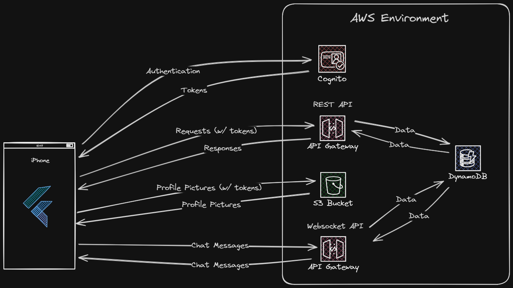

# PhitNest Monorepo

### Submodules

Some of our code is split into submodules, which are just separate GitHub repositories nested inside this repository. We use submodules so that individual repositories can have their own GitHub Actions workflows/secrets independent of each other, and so that certain components of our codebase can be private and some can be public. The submodules are:

- [mobile](https://github.com/PhitNest/mobile) (public) - Flutter application for mobile
- [backend](https://github.com/PhitNest/backend) (private) - REST API, AWS Lambda functions, and other backend components

### To clone this repo + all submodules:

These commands will clone the monorepo, and all the submodules.

```bash
git clone https://github.com/phitnest/phitnest.git --recurse-submodules
git submodule update --init --recursive .
git submodule foreach git checkout master
```

### To pull changes for monorepo + all submodules:

From monorepo:

```bash
git submodule foreach git pull
```

### Pull Requests, Commits, and Submodules

If your changes are part of:

- `apps/mobile`
- `apps/backend`

Then your changes are part of a submodule.

If your changes are not part of a submodule (docs, vscode configs, etc.), just commit your changes directly to the monorepo.

PRs should be made to the submodules, not the monorepo.

If your changes are part of a submodule, just commit directly to the submodule. I.E. for making commits to the mobile app:

```bash
cd apps/mobile
git add .
git commit -m "Committing to mobile app submodule"
git push
```

Commits made to submodules will be automatically propogated up to the monorepo via GitHub actions.

### System Architecture


